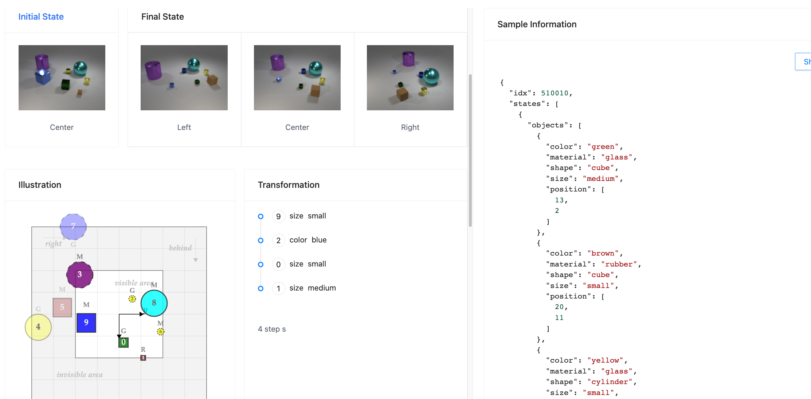

# TVR - Transformation driven Visual Reasoning

<br>

Official repository for ["Transformation driven Visual Reasoning"](https://github.com/hughplay/TVR).

<!--  -->


**Figure:** *Given the initial state and the final state, the target is to infer the intermediate transformation.*

> **Transformation driven Visual Reasoning** <br>
> Xin Hong, Yanyan Lan, Liang Pang, Jiafeng Guo, Xueqi Cheng <br>
> *Published on 2021 IEEE/CVF Conference on Computer Vision and Pattern Recognition (CVPR)*

[](https://hongxin2019.github.io/TVR/)
[](https://github.com/hughplay/TVR)
[](https://hongxin2019.github.io/TVR/dataset)
[](https://hongxin2019.github.io/TVR/explore)
[](https://arxiv.org/pdf/2011.13160.pdf)
[](https://pytorch.org/get-started/locally/)


<br>

## Description

**Motivation:** Most existing visual reasoning tasks, such as CLEVR in VQA, are solely defined to test how well the machine understands the concepts and relations within static settings, like one image. We argue that this kind of **state driven visual reasoning** approach has limitations in reflecting whether the machine has the ability to infer the dynamics between different states, which has been shown as important as state-level reasoning for human cognition in Piaget’s theory.

**Task:** To tackle aforementioned problem, we propose a novel **transformation driven visual reasoning** task. Given both the initial and final states, the target is to infer the corresponding single-step or multi-step transformation.

If you find this code useful, please consider to star this repo and cite us:

```
@inproceedings{hongTransformationDrivenVisual2021d,
  title = {Transformation {{Driven Visual Reasoning}}},
  booktitle = {2021 {{IEEE}}/{{CVF Conference}} on {{Computer Vision}} and {{Pattern Recognition}} ({{CVPR}})},
  author = {Hong, Xin and Lan, Yanyan and Pang, Liang and Guo, Jiafeng and Cheng, Xueqi},
  year = {2021},
  pages = {6899--6908}
}
```


<br>

## Environment Setup

We use docker to manage the environment. You can build the docker image and enter the container with the following command:

``` sh
# build the docker image and launch the container
python docker.py prepare
# enter the container
python docker.py
```

Please follow the prompts to set the variables such as `PROJECT`, `DATA_ROOT`, `LOG_ROOT`.


<br>

## Data Preparation

Download TRANCE from Kaggle and put it under `DATA_ROOT/trance`. Then preprocess the data with the following command:

```
python scripts/preprocess /data/trance
```


<br>

## Training & testing

Please refer to the scripts under `scripts/training` for training models.

Example training script (execute inside the docker container):

``` bash
python train.py experiment=event_cnn_concat logging.wandb.tags="[event, base]"
```

Or, you can training multiple models with provided GPUs:

``` bash
python scripts/batch_train.py scripts/training/train_models.sh --gpus 0,1,2,3
```

Notice: We fixed a bug in TRANCE, therefore, the performance on Event and View is slightly higher (0.03~0.06 on Acc) than the results reported in our CVPR paper.


<br>

## Demo

We provide a demo to explore the dataset and experiments.



To launch the demo, first launch the api server:

```
uvicorn src.demo.api_server.main:app --host 0.0.0.0 --reload
```

Then launch the ui in another terminal window (recommend tmux):

``` sh
cd src/demo/ui
yarn
yarn dev
```

<br>

## LICENSE

The code is licensed under the [MIT license](./LICENSE) and the TRANCE dataset is licensed under the <a rel="license" href="http://creativecommons.org/licenses/by-nc/4.0/">Creative Commons Attribution-NonCommercial 4.0 International License</a>.

Notice: Some materials are directly inherited from [CLEVR](https://github.com/facebookresearch/clevr-dataset-gen) which are licensed under BSD License. More details can be found in [this document](data/gen_src/resource/README.md).

<br>

*This is a project based on [DeepCodebase](https://github.com/hughplay/DeepCodebase) template.*
