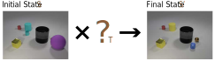

# TVR - Transformation driven Visual Reasoning

**| [Project](https://hongxin2019.github.io/TVR/) | [Paper](https://arxiv.org/pdf/2011.13160) |**

**Task:** Given both the initial and final states, the target is to infer the corresponding single-step or multi-step transformation.

<p align="center">
    
</p>

## Dataset Generation

Please see the [README.md](data/gen_src) for data generation.


## Model Training and Evaluation

Coming soon...


## Citing TVR

If you find TVR useful for your research then please cite:

```
@article{hong2020tvr,
    title={Transformation Driven Visual Reasoning},
    author={Xin Hong, Yanyan Lan, Liang Pang, Jiafeng Guo and Xueqi Cheng},
    year = {2020},
    journal={arXiv}
}
```


## LICENSE

<a rel="license" href="http://creativecommons.org/licenses/by-nc/4.0/"></a><br />This work is licensed under a <a rel="license" href="http://creativecommons.org/licenses/by-nc/4.0/">Creative Commons Attribution-NonCommercial 4.0 International License</a>

Notice: Some materials are directly inherited from [CLEVR](https://github.com/facebookresearch/clevr-dataset-gen) which are licensed under BSD License. More details can be found in [this document](data/gen_src/resource/README.md).
