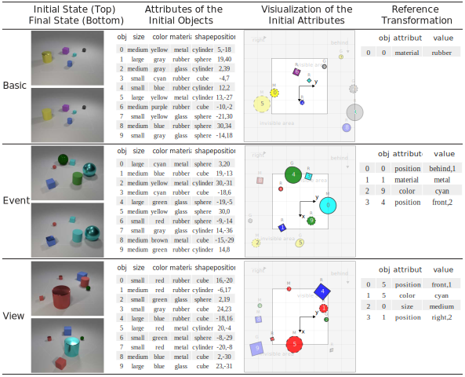

# TRANCE Dataset Generation

This is the code used to generate the TRANCE dataset as described in the paper.

**[Transformation Driven Visual Reasoning](https://arxiv.org/pdf/2011.13160.pdf)**
<br>
[Xin Hong](https://hongxin2019.github.io/), [Yanyan Lan](http://www.bigdatalab.ac.cn/~lanyanyan/), [Liang Pang](http://www.bigdatalab.ac.cn/~pangliang/), [Jiafeng Guo](http://www.bigdatalab.ac.cn/~gjf/), [Xueqi Cheng](http://www.bigdatalab.ac.cn/~cxq/)

You can use this code to render synthetic samples, like this:



## Step 1: Blender Installation

Samples in TRANCE are generated by 3D engine [Blender](https://www.blender.org/). The blender version we used is 2.79 and the script (`install_blender.sh`) can be run to install blender and some dependencies conveniently.

You can test your blender installation by running:
```
blender --background --version
```

### The `libGLU.so.1` issue

If you encounter `libGLU.so.1` issue in Ubuntu, please try:
``` sh
sudo apt-get install libglu1
```
for CentOS users, please try:
``` sh
sudo yum install mesa-libGLU libXi libXrender
```


## Step 2: Data Generation

All configurations are listed in [`configs/standard.yaml`](configs/standard.yaml), the settings can be changed permanently by changing this file or temporarily changed in the command line.

You can generate TRANCE like this:
``` sh
blender --background --python render.py -- --config configs/standard.yaml --gpu false --render_tile_size 16
```

If you have NVIDIA GPUs with CUDA installed then you can use the GPU to accelerate image rendering like this:
``` sh
blender --background --python render.py -- --config configs/standard.yaml
```
By default, it will use all available GPUs. You can `export CUDA_VISIBLE_DEVICES=<gpu_ids>` to limit the GPU cards used for rendering. In practice, we find 1/2 GPU card(s) are cost-efficient. 

## Tips for data generation

### Generating large amount samples

We balance our dataset by using dynamic sampling probabilities which means generating the next sample depends on all previous samples' states:

```
1, 2, ... n -> n+1
```

The most time consuming part of data generation is image rendering. Therefore, to generate samples in parallel, we first generate all samples (`.json` files only) without rendering images, and then we can simultaneously render images (`.png` files) of different segments based on samples' states (`.json` files).


```
-> generate samples (all) -> render images (0 ~ 10000)
                          -> render images (10000 ~ 20000)
                          -> render images (20000 ~ 30000)
                          -> render images (30000 ~ 40000)
                          -> render images (...)
```

**1\. Generate samples (`.json` files only) without rendering (requires CPU only):**

```
blender --background --python render.py -- --config configs/standard.yaml --no_render --n_samples 510000
```

**2\. Render different segments of samples (`.png` files) in parallel.**

For example, render 200000\~210000 on GPU 0, 1:

```
export CUDA_VISIBLE_DEVICES=0,1 && blender --background --python render.py -- --config configs/standard.yaml --replace_start 200000 --n_sample 210000
```

Render 210000\~220000 on GPU 2, 3:

```
export CUDA_VISIBLE_DEVICES=2,3 && blender --background --python render.py -- --config configs/standard.yaml --replace_start 210000 --n_sample 220000
```

**3\. Render images with lower resolution**

The standard resolution for rendering is 320 (width) * 240 (height). In our experiments, we use 160 (width) * 120 (height) for fast training. Therefore, if you really need to reduce the time for data generation and lower resolution is not a problem for you, you could modify the `width` and `height` in `configs/standard.yaml` or run:
```
blender --background --python render.py -- --config configs/standard.yaml --width 160 --height 120
```

**Notice:** *Be careful to change `seg_width` and `seg_height`, since `occlusion_threshold` is set based on the resolution of segmentation maps.*

**4\. More**

There are still some works can be done to speed up the data generation process.
- [x] Render images (`.png` files) directly based on generated `.json` files (Completed, see the description above).
- [ ] Using a faster method to render the segmentation map of each sample (The segmentation map is used to judge whether objects are occluded and currently used `BLENDER_RENDER` rendering engine can not be parallelized to use multiple CPUs).